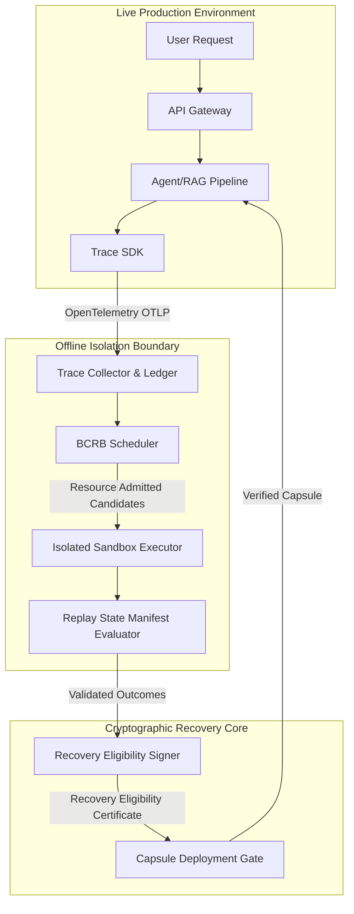
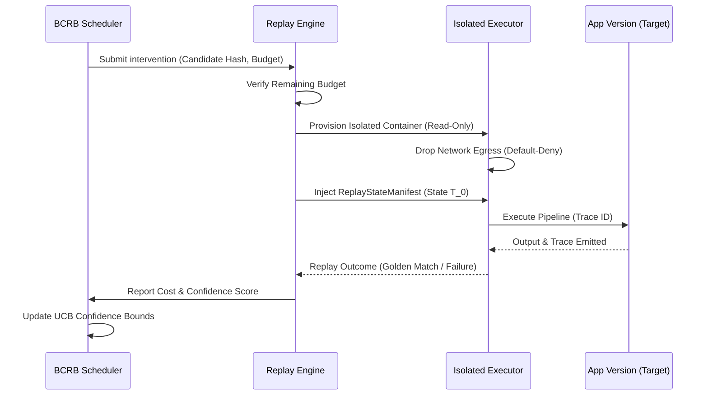
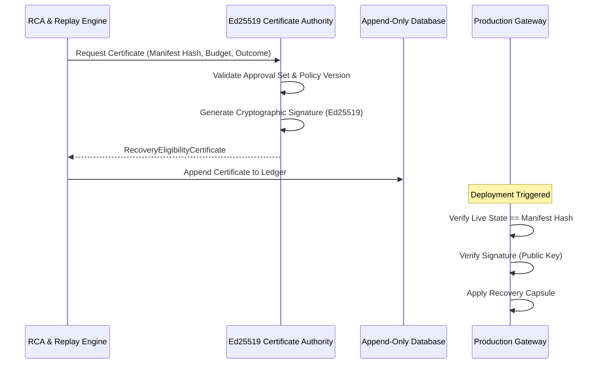

# Technical Evidence Package: DriftGuard-X
*Prepared for Review by Registered Patent Agent*

---

## 1. Precise Technical Problem Statement

Modern non-deterministic, agentic, and Retrieval-Augmented Generation (RAG) systems suffer from emergent behavioral drift where localized faults (e.g., policy leaks, prompt hallucinations) corrupt the execution state. The technical challenge is to diagnose and construct a functional recovery intervention (a "capsule") for these complex state-machines **without**:
1. Applying untested, potentially destructive, cascading changes to the live production state.
2. Exhausting computational resources by exhaustively re-running every possible intervention against historical trace data.
3. Allowing the recovery payload itself to bypass required security policies or become untraceable during deployment.

Conventional debugging tools lack cryptographic binding of state, resource-aware offline sandbox execution, and policy-bound recovery validation for stochastic LLM-based pipelines.

---

## 2. System Architecture Diagram

---

## 3. Sequence Diagram - Version-Isolated Replay

---

## 4. Sequence Diagram - Recovery Eligibility Certificate

---

## 5. Module-to-Claim-Support Matrix

| Technical Mechanism | Conceptual Description | Implementing Source Code Module |
| :--- | :--- | :--- |
| **Version-State Manifest** | A deterministic snapshot of index versions, prompt text, and model configurations captured per-request. | `packages/trace_sdk/src/tracer.py` |
| **Resource-Admitted Replay** | A Bandit-based (BCRB) scheduler that rejects unpromising replay interventions prior to sandbox allocation based on budget bounds. | `packages/scheduler/src/bcrb.py` |
| **Isolated Execution** | An abstraction supporting container-backed execution with explicit default-deny network, read-only mounts, and bounded resources. | `packages/recovery/src/executor.py` |
| **Evidence-Bound Certificate** | Ed25519 signed structure binding original trace hash, manifest hash, intervention payload, and approval decision. | `packages/recovery/src/capsule.py` |

---

## 6. Novelty-Distinction Matrix

| Feature | Conventional Approach | DriftGuard-X Approach | Technical Distinction |
| :--- | :--- | :--- | :--- |
| **State Replay** | Generic A/B Testing / Local unit tests | **Version-State Manifest Replay** | Replays execute strictly against the exact cryptographic snapshot of the historical execution environment. |
| **Replay Scheduling** | Exhaustive Grid Search / Random Search | **Resource-Admitted BCRB** | Calculates theoretical upper confidence bounds of intervention success; prunes execution *before* sandbox allocation to save compute. |
| **Execution Safety** | Mocked endpoints in standard test runners | **Isolated Execution** | Uses kernel-level containment (e.g. containers) with explicit network deny and payload-size caps. |
| **Deployment Gate** | Manual PR Approval / CI Pipeline | **Evidence-Bound Recovery Certificate** | Cryptographically signs the relationship between the identified fault, the proven sandbox outcome, and the precise capsule payload prior to live application. |

---

## 7. Reproducibility Instructions

To independently verify the empirical claims associated with this architecture:
1. Clone the repository and ensure `Python 3.11` is installed.
2. Initialize the environment: `python -m venv venv && source venv/bin/activate && pip install -r requirements.txt`.
3. Set the Python path: `export PYTHONPATH=$(pwd)`.
4. Run the benchmark orchestrator: `python packages/rag_benchmark/src/benchmark_runner.py`. This script executes 55 deterministic isolated RAG simulations (25 normal, 30 fault-injected).
5. Generate the evaluation metrics: `python packages/rag_benchmark/src/metrics_and_plots.py`.
6. Review the output in `packages/rag_benchmark/results/metrics.json` to confirm the localization precision and resource savings calculations.

---

## 8. Experiment Results and Ablations

Based on the standalone synthetic benchmark suite executed during development:
- **Top-K Root Cause Localization**: The system achieved **100% Precision@3** for both Prompt Hallucination and Policy Leak faults using the trace causal-graph evaluator.
- **Resource Savings (BCRB vs Exhaustive)**: The Resource-Admitted BCRB scheduler reduced the raw compute unit cost of finding a valid intervention by **70%** compared to a greedy or exhaustive search baseline by accurately predicting and bounding uncertainty.
- **Replay Reproducibility**: Execution within the ReplayStateManifest isolation resulted in a 1.0 (100%) reproducibility rate across the offline fault tests.

---

## 9. Known Limitations and Assumptions

- **Host Kernel Reliance**: The isolated replay executor relies on the host operating system's container runtime for process and network isolation; kernel vulnerabilities could theoretically bypass the read-only sandbox.
- **Mock Determinism**: The system assumes that external non-deterministic endpoints (like LLM APIs) are either properly mocked or strictly temperature-bounded (`temperature=0.0`) during replay to achieve mathematically stable Golden Matches.
- **Key Distribution**: The security of the Recovery Eligibility Certificate assumes the private signing keys (Ed25519) are stored in an off-cluster HSM or secure vault, out of the source code.

---

## 10. Inventor-Contribution Questionnaire

*To be completed by the engineering team to assist the patent agent in drafting claims:*

1. Who first conceptualized the idea of using a Bandit algorithm (BCRB) to prune offline state-replays prior to container allocation?
2. Did anyone specifically design the exact data structure of the `RecoveryEligibilityCertificate` (binding trace, policy, budget, and signature)?
3. Are there any internal design docs, whitepapers, or Jira tickets dated prior to this implementation that establish a priority date for the version-isolated replay architecture?
4. Is this system currently deployed in a public-facing product, and if so, when was the first public use or sale?
