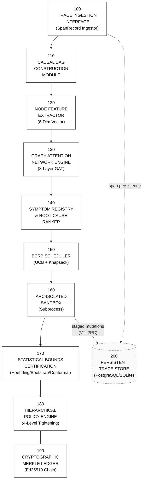
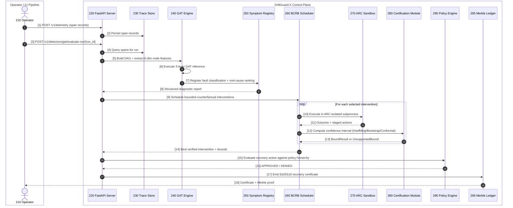
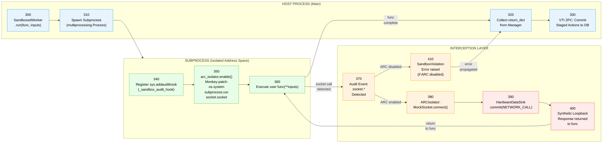
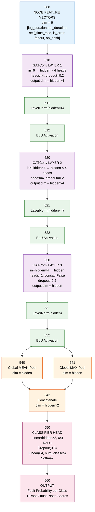
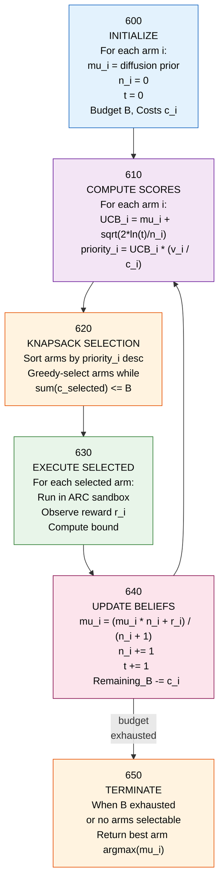
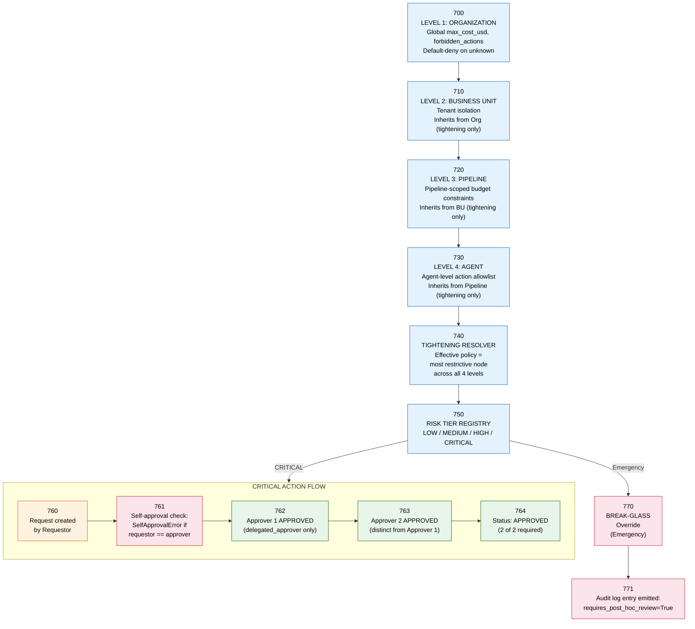
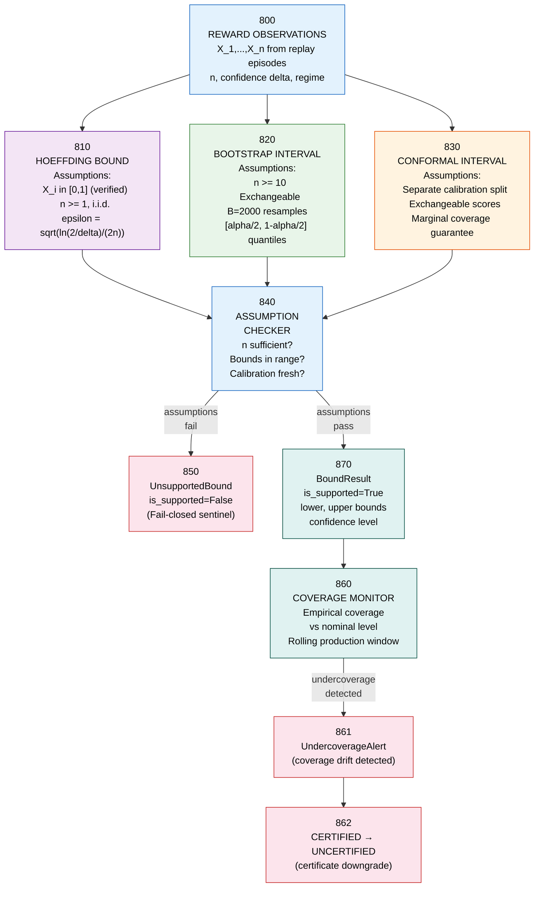
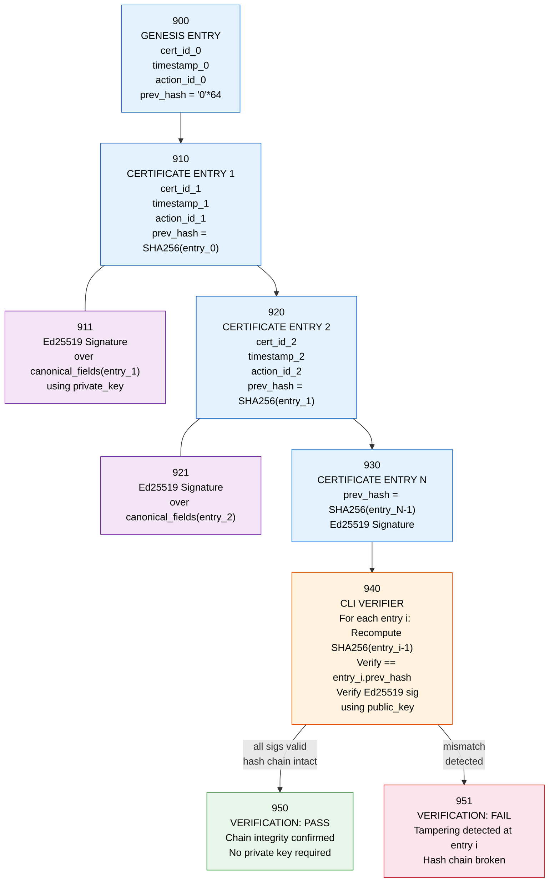

# DriftGuard-X Patent Application Figures

**Status: CONFIDENTIAL — Pre-Filing. Not Legal Advice.**

Each figure below corresponds to the BRIEF DESCRIPTION OF THE DRAWINGS in the patent claims draft. These are intended for conversion to formal USPTO-compliant black-and-white line drawings by patent illustration counsel.

---

## FIG. 1 — Overall System Architecture

---

## FIG. 2A — End-to-End Data Flow (Sequence Diagram)

---

## FIG. 2B — ARC Isolation Subsystem Detail

---

## FIG. 3 — Graph Attention Network Architecture

---

## FIG. 4 — BCRB Scheduler: UCB + Knapsack Mechanism

---

## FIG. 5 — Four-Level Policy Inheritance Hierarchy

---

## FIG. 6 — Statistical Bounds Certification Pipeline

---

## FIG. 7 — Tamper-Evident Ed25519 Merkle Ledger

---

*CONFIDENTIAL — These figures are intended for conversion to formal USPTO black-and-white line drawings by patent illustration counsel. Not a legal filing.*
