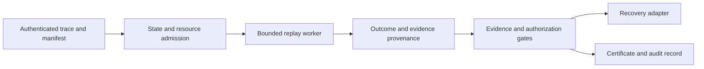
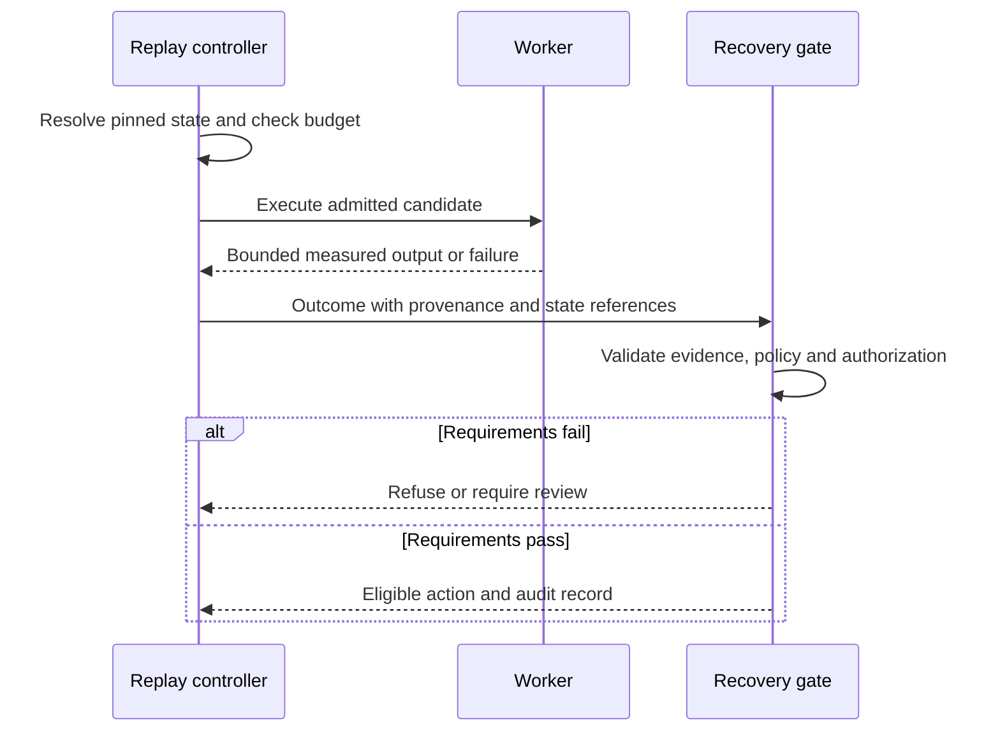

# DriftGuard-X Technical Disclosure

Updated: 2026-09-08. Target jurisdiction: India.
Technical handoff for patent-agent review; not a filed specification.

## Problem and candidate contribution

Recovery testing can execute the wrong historical state, consume the available
diagnostic budget, or authorize a change using weak or misbound evidence. DriftGuard-X
implements modules for manifest-based replay, resource admission, bounded execution,
evidence provenance, and recovery policy controls.

The candidate contribution is their specific enforcement relationship. Whether this
relationship is inventive is unresolved. The prior-art worksheet records material
overlap with counterfactual replay repair and resource-constrained bandits.

## Implemented operation

1. Accept instrumented trace records and identify the tenant through authenticated
   membership at the API boundary. Graph relationships describe recorded dependencies;
   detector scores rank hypotheses and are not causal proof.
2. Represent replay inputs and component versions in ReplayStateManifest. The replay
   engine refuses absent or unpinned manifests. Manifest hashes describe state content;
   ownership must be enforced independently because some identity fields are excluded.
3. Rank admitted candidate arms by estimated reward plus exploration bonus divided by
   estimated cost. Admission uses predicted cost and uncertainty against remaining
   budget after the configured rollback reserve. The margin is heuristic, not a
   probabilistic resource guarantee.
4. Execute through an isolated worker. Process termination bounds elapsed time.
   Serialized results are transferred incrementally with a size ceiling. Platform
   resource controls have limitations documented in the sandbox source.
5. Compute evidence statistics under stated assumptions. Invalid confidence, nonfinite
   observations, invalid residuals, and unattainable finite conformal ranks fail closed.
   Numeric arrays cannot prove independent sampling or a held-out calibration split.
6. Evaluate policy, evidence and authorization in the appropriate recovery path.
   Rollback capsules bind execution conditions in a digest. Signed certificate and
   ledger components provide separate signature and hash-link verification.

These are implemented mechanisms across multiple paths; the diagram is an intended
composition, not a statement that the standalone BM25 benchmark traverses the API,
sandbox, signer, or production adapter.

## Example and failure behavior

A controlled retriever experiment removes relevant documents from an in-memory BM25
search. Candidate interventions alter one search condition at a time. Recovery is
measured against the original query's relevance labels. The baseline with the known
correct repair is explicitly labelled oracle; the neutral prior receives no repair
label and the wrong prior deliberately prioritizes another repair.

An empty replay manifest is rejected. A conformal request with ten residuals at
99 percent confidence returns unsupported. Editing the sealed rollback expiry,
target state or compatibility constraints invalidates capsule integrity. These
are concrete refusal behaviors, not evidence of patent novelty.

## Technical figures

## Measurements and limitations

Use results/patent_review for newly generated, hash-bound controlled retrieval
experiments and the evidence package for commands and interpretation. Earlier
claims of 200 ms certification, universal 70 percent savings, and inevitable
Ed25519 throughput bottlenecks have no verified support in this audit and are
withdrawn. No inference accuracy or novelty follows from a passing unit test.

VTI and ARC include simulation behavior. Temperature zero does not establish
external-model determinism. The local SQLite/mock-auth console is a demonstration.
Hosted deployment, independent security assessment and production canaries remain
separate engineering gates.
